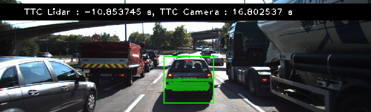
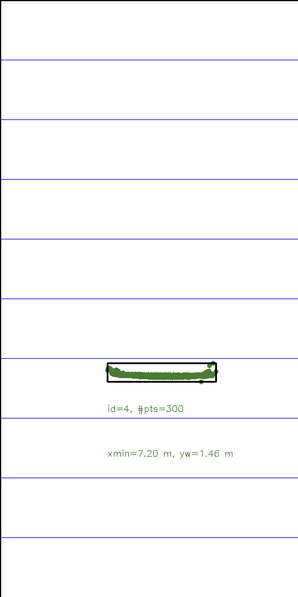
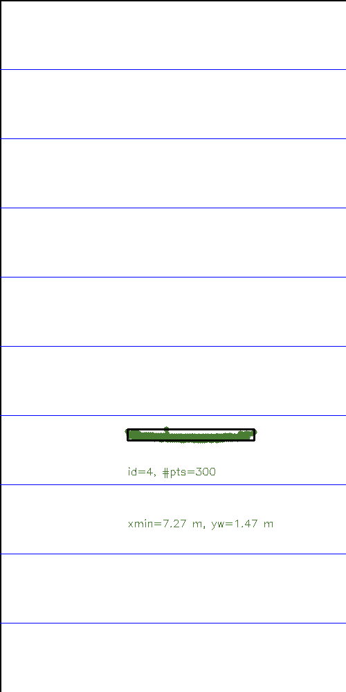
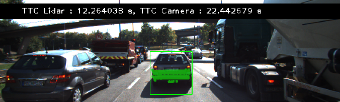
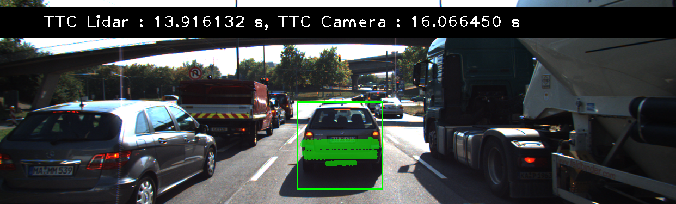
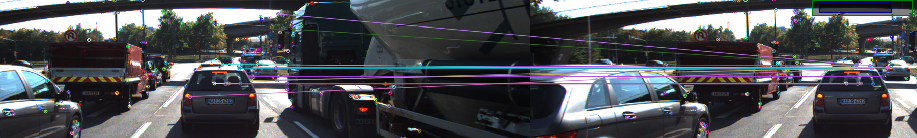

# FP.1 Match 3D Objects

**Criteria**: Implement the method "matchBoundingBoxes", which takes as input both the previous and the current data frames and provides as output the IDs of the matched regions of interest (i.e. the boxID property). Matches must be the ones with the highest number of keypoint correspondences.

**Approach**:

1) Traverse all "matches", find all possible paired boundingbox in each "matches", store all possible paired bounding box id in variables of type vector<pair<int, int >> named "multimap".
2) Calculate all possible matching combinations of the bounding box in the previous frame and the next frame,store in variables of type vector<pair<int, int >> named "ps".
3) Calculate the number of each possible pairing combination in "ps" in "multimap", and store it in an array of type vector<pair<pair<int,int>,int>>, named "multimap_temp".
4) Find each BoundingBox ID in currFrame with the largest number of matches in "multimap_temp", and store it in an array of type vector<pair<pair<int,int>,int>> named "pmaxs".
5) Find each BoundingBox ID in preFrame with the largest number of matches in "pmaxs", and store it in an array of type vector<pair<pair<int,int>,int>> named "p2r_maxs".
6) Finally, assign the pairing combination of p2r_maxs to bbBestMatches.

# FP.2 Compute Lidar-based TTC

**Criteria**: Compute the time-to-collision in second for all matched 3D objects using only Lidar measurements from the matched bounding boxes between current and previous frame.

**Approach**: My approach to calculate the Lidar-based TTC is based on the CVM (Constant Velocity Model) formula, which is `TTC = d1 * (1.0 / frameRate) / (d0 - d1)`, where `d0` and `d1` are the median  values of the Lidar points in the vehicle driving direction (i.e. x-axis) in the previous and current frame, rather than the using the closest Lidar points in the x-axis to minimize the variations of the noisy lidar measurements.

# FP.3 Associate Keypoint Correspondences with Bounding Boxes

**Criteria**: Prepare the TTC computation based on camera measurements by associating keypoint correspondences to the bounding boxes which enclose them. All matches which satisfy this condition must be added to a vector in the respective bounding box.

**Approach**: 

1. Iterate "kptMatches" to find out which kptMatches's keypoints are enclosed within the bounding box and caculate the sum of distance between
2. Calculate the average Euclidean distance between the previous and current key points that are enclosed in the bounding box.
3. For each keypoint matches in the bounding box, find out inlier matches that the Euclidean distance of the match is underneath the threshold 1.5 times the mean Euclidean distance

# FP.4 Compute Camera-based TTC

**Criteria**: Compute the time-to-collision in second for all matched 3D objects using only keypoint correspondences from the matched bounding boxes between current and previous frame.

**Approach**: My approach to compute the camera-based TTC is based on the median value of the distance ratio of the preceding vehicle over a time step. 

1. Calculate the distance ratios between all matched keypoints by first getting the Euclidean distance current keypoint and its matched partner in the prev. frame, as well as the next keypoint and its matched partner in the prev. frame.

For example:

```cpp
double distPrev = cv::norm(kptOuterPrev.pt - kptInnerPrev.pt);
double distCurr = cv::norm(kptOuterCurr.pt - kptInnerCurr.pt);
```

2. Then sort the distance ratio in ascending order, find the median distance ratio to remove outlier influence

3. Finally apply the camera-based TTC from distance ratios formula to calculate the TTC.

```cpp
// Compute camera-based TTC from distance ratios
double dT = 1.0 / frameRate;
TTC = -dT / (1 - medDistRatio);
```
# FP.5 Performance Evaluation 1

**Criteria**: Find examples where the TTC estimate of the Lidar sensor does not seem plausible. Describe your observations and provide a sound argumentation why you think this happened.

### Condition 1: The TTC value should never be negative


The TTC value should never be negative as the TTC is predicting the time in the future. Referring to the CVM (Constant Velocity Model) TTC formula we used `TTC = d1 * (1.0 / frameRate) / (d0 - d1)`, it means that in order to result a negative value that the d1 must be greater than d0. In other words, the distance measured to the preceedinge vehicle in the previous frame is smaller than the current frame.

Given the KITI dataset used in this project, the preceding vehicle is stationary, therefore it is likely the error is due to the noisy Lidar sensor measurements. as shown in the lidar point top view image below ,left is preFrame has a noise measurement, then if we choose the closest point, may cause a negative estimate of TTC.

One possible workaround is to take the median value of the lidar points in x-axis rather than the closest x-value of the lidar poitns.


**Lidar points top view : preFrame(left) and currFrame(right)** 


<center class="half">
         
        
</center>


### Condition 2: The TTC value should decrease monotonically

**preFrame TTC Lidar = 12.264038 s**



**currFrame TTC Lidar = 13.916132 s**


**observations** The TTC value does not decrease monotonicallymonotonically.

The TTC value should decrease monotonically. For the same reason above, given the KTTI dataset used in the project, the prceeding vehicle ahead of the ego vehicle is stationary, therefore the TTC value in current frame should not be larger than the previous frame at any time.

## FP.6 Performance Evaluation 2

**Criteria**: Run several detector / descriptor combinations and look at the differences in TTC estimation. Find out which methods perform best and also include several examples where camera-based TTC estimation is way off. As with Lidar, describe the observations again and also look into potential reasons.

**The table bellow shows TTC estimate of all detector / descriptor combinations**

|          | 1        | 2        | 3        | 4        | 5        | 6        | 7        | 8        | 9        | 10        | 11       | 12        | 13       | 14       | 15       | 16      | 17      | 18      |
|-----------------|----------|----------|----------|----------|----------|----------|----------|----------|----------|-----------|----------|-----------|----------|----------|----------|---------|---------|---------|
| SHITOMASI_BRISK | 15.700   | 12.763   | 13.526   | 13.759   | 12.854   | 11.414   | 12.900   | 13.992   | 12.002   | 57.215    | 12.776   | 11.764    | 11.400   | 12.009   | 10.417   | 11.454  | 9.543   | 9.837   |
| SHITOMASI_BRIEF | 14.676   | 14.402   | 9.740    | 14.982   | 12.750   | 13.270   | 15.266   | 12.085   | 11.870   | 12.629    | 11.851   | 11.764    | 11.720   | 11.356   | 12.198   | 8.240   | 11.138  | 8.431   |
| SHITOMASI_ORB   | 13.874   | 11.659   | 12.067   | 13.079   | 12.093   | 13.228   | 12.860   | 11.921   | 11.265   | 13.942    | 11.471   | 11.562    | 11.634   | 11.426   | 10.691   | 9.898   | 9.538   | 8.217   |
| SHITOMASI_FREAK | 15.558   | 12.820   | 10.451   | 14.333   | 12.909   | 14.954   | 12.248   | 12.801   | 11.232   | 13.667    | 11.498   | 12.710    | 11.942   | 11.803   | 12.165   | 11.124  | 10.318  | 10.525  |
| SHITOMASI_SIFT  | 14.013   | 11.782   | 10.955   | 12.674   | 11.832   | 12.995   | 13.418   | 13.257   | 12.209   | 13.514    | 12.103   | 11.539    | 11.389   | 11.574   | 10.848   | 7.476   | 11.036  | 8.233   |
| HARRIS_BRISK    | 10.908   | 11.008   | -11.473  | 11.395   | 44.917   | 13.622   | 13.497   | 17.620   | 0.136    | -153.930  | 11.814   | 11.695    | 284.161  | 7.721    | -12.339  | 8.523   | 12.585  | 0.687   |
| HARRIS_BRIEF    | 10.908   | 63.848   | -11.473  | 11.579   | 35.383   | 15.248   | 14.274   | 17.620   | 3.939    | 20.586    | 11.155   | 12.245    | 13.433   | 5.661    | -13.626  | 6.764   | 12.585  | 12.838  |
| HARRIS_ORB      | 10.908   | 63.848   | -11.473  | 11.579   | 13.643   | 13.622   | 13.497   | 35.151   | 3.903    | 20.586    | 11.670   | 11.695    | 568.322  | 6.070    | -Inf     | 6.603   | 12.585  | -Inf    |
| HARRIS_FREAK    | 9.750    | -0.520   | -80.853  | 12.128   | -Inf     | 15.527   | 13.191   | -Inf     | 0.138    | 10.293    | 11.097   | 12.245    | 13.433   | 0.501    | -12.639  | 11.795  | 11.796  | 25.676  |
| HARRIS_SIFT     | 10.908   | -18.670  | -20.095  | 11.579   | 13.643   | 27.874   | 13.497   | 17.620   | -6.087   | 20.586    | 11.155   | 12.245    | 13.433   | 5.661    | -13.626  | 7.292   | 11.796  | -Inf    |
| FAST_BRISK      | 12.500   | 12.622   | 14.444   | 12.714   | 53.068   | 12.199   | 15.988   | 11.093   | 13.411   | 12.527    | 14.251   | 11.436    | 11.943   | 12.228   | 12.140   | 12.463  | 8.516   | 11.414  |
| FAST_BRIEF      | 10.803   | 11.006   | 14.156   | 14.389   | 19.951   | 13.293   | 12.172   | 12.760   | 12.600   | 13.464    | 13.672   | 10.909    | 12.371   | 11.243   | 11.875   | 11.840  | 7.920   | 11.554  |
| FAST_ORB        | 11.011   | 10.759   | 11.417   | 12.834   | 17.820   | 12.999   | 11.603   | 11.169   | 12.112   | 13.347    | 13.788   | 10.896    | 12.041   | 10.730   | 11.168   | 11.195  | 7.854   | 10.610  |
| FAST_FREAK      | 12.750   | 28.850   | 15.966   | 15.175   | 16.073   | 13.999   | 14.677   | 11.903   | 12.004   | 12.079    | 13.100   | 12.003    | 12.329   | 11.490   | 11.375   | 12.138  | 8.565   | 12.171  |
| FAST_SIFT       | 12.691   | 10.713   | 13.529   | 13.995   | 26.363   | 12.890   | 13.467   | 13.705   | 12.980   | 14.099    | 15.164   | 11.686    | 12.011   | 11.343   | 11.404   | 11.151  | 7.652   | 12.101  |
| BRISK_BRISK     | 13.935   | 15.073   | 12.535   | 15.414   | 24.362   | 15.572   | 18.185   | 16.764   | 14.554   | 14.146    | 13.132   | 11.498    | 12.867   | 11.751   | 12.518   | 10.358  | 9.418   | 10.536  |
| BRISK_BRIEF     | 13.822   | 18.091   | 12.326   | 21.824   | 25.902   | 19.194   | 17.861   | 18.388   | 14.962   | 12.046    | 11.534   | 14.149    | 12.893   | 10.319   | 11.104   | 12.828  | 11.196  | 9.518   |
| BRISK_ORB       | 13.676   | 16.505   | 13.275   | 17.112   | 21.735   | 16.263   | 19.406   | 14.579   | 12.530   | 12.647    | 13.477   | 10.815    | 11.841   | 11.510   | 12.159   | 10.807  | 9.889   | 10.763  |
| BRISK_FREAK     | 14.832   | 24.646   | 15.155   | 13.777   | 24.355   | 14.021   | 14.152   | 17.038   | 18.630   | 13.064    | 12.354   | 12.603    | 12.540   | 11.799   | 12.295   | 10.117  | 8.782   | 10.520  |
| BRISK_SIFT      | 15.839   | 14.890   | 18.460   | 18.129   | 35.743   | 13.873   | 15.901   | 19.150   | 16.386   | 13.818    | 12.612   | 13.779    | 12.911   | 10.704   | 13.208   | 10.490  | 10.566  | 13.871  |
| ORB_BRISK       | 17.484   | 15.537   | 19.223   | 21.301   | 73.249   | 12.618   | 17.360   | 11.100   | 11.979   | 13.306    | 8.495    | 5416.200  | 8.338    | 9.260    | 8.859    | 9.371   | 17.296  | 18.640  |
| ORB_BRIEF       | 16.481   | 16.969   | 30.925   | 25.217   | 25.429   | 18.258   | 40.024   | 31.848   | 65.953   | 10.739    | 10.439   | 16.609    | 10.800   | 8.406    | 10.529   | 13.496  | 18.761  | 13.275  |
| ORB_ORB         | 24.781   | 10.667   | 13.221   | 22.170   | 25.772   | 10.798   | 40.355   | 10.869   | 15.134   | 14.691    | 9.006    | -Inf      | 9.264    | 11.473   | 12.944   | 9.541   | 25.643  | 23.730  |
| ORB_FREAK       | 11.937   | 25.202   | 17.537   | 11.280   | 52.139   | 29.893   | 127.591  | 10.058   | 13.329   | -545.044  | 8.408    | 35.849    | 7.030    | 55.788   | 8.724    | 11.102  | -Inf    | 24.186  |
| ORB_SIFT        | 17.443   | 11.245   | 19.223   | -Inf     | 32.546   | 20.720   | 17.617   | 10.864   | 11.507   | 11.103    | 9.202    | -Inf      | 9.725    | 26.135   | 24.635   | 10.980  | 18.733  | 9.113   |
| AKAZE_BRISK     | 12.290   | 14.767   | 13.723   | 14.253   | 14.125   | 15.089   | 16.200   | 14.394   | 13.968   | 11.399    | 12.751   | 11.296    | 10.521   | 10.545   | 10.000   | 9.993   | 9.441   | 8.953   |
| AKAZE_BRIEF     | 13.377   | 15.381   | 13.141   | 14.596   | 15.603   | 13.641   | 15.739   | 14.460   | 14.110   | 11.896    | 13.026   | 12.168    | 10.249   | 10.126   | 9.151    | 10.146  | 9.539   | 8.844   |
| AKAZE_ORB       | 12.828   | 14.695   | 13.058   | 13.862   | 15.613   | 14.148   | 15.776   | 14.240   | 13.922   | 11.392    | 12.150   | 11.642    | 10.685   | 10.357   | 9.664    | 10.393  | 9.159   | 8.997   |
| AKAZE_FREAK     | 12.773   | 13.770   | 14.131   | 13.856   | 15.192   | 14.368   | 15.694   | 13.989   | 13.089   | 11.878    | 12.047   | 10.700    | 10.928   | 9.978    | 9.245    | 9.815   | 9.570   | 8.862   |
| AKAZE_AKAZE     | 12.584   | 14.658   | 12.949   | 14.616   | 16.514   | 13.251   | 15.212   | 14.557   | 14.152   | 11.586    | 12.187   | 11.502    | 10.425   | 10.434   | 10.654   | 10.094  | 9.360   | 9.006   |
| AKAZE_SIFT      | 12.661   | 14.650   | 13.152   | 14.172   | 17.036   | 13.773   | 15.495   | 14.147   | 14.154   | 11.648    | 12.706   | 11.391    | 10.919   | 10.463   | 9.830    | 10.121  | 9.462   | 8.844   |
| SIFT_BRISK      | 13.518   | 12.571   | 12.553   | 22.587   | 18.440   | 9.138    | 15.127   | 12.891   | 13.863   | 10.235    | 10.965   | 10.418    | 9.905    | 11.052   | 9.487    | 9.645   | 8.908   | 9.410   |
| SIFT_BRIEF      | 11.996   | 12.677   | 13.934   | 21.800   | 14.164   | 11.063   | 13.132   | 16.172   | 12.847   | 10.089    | 12.045   | 9.451     | 9.604    | 9.353    | 8.742    | 8.867   | 8.615   | 9.414   |
| SIFT_FREAK      | 12.105   | 12.560   | 13.377   | 19.699   | 13.512   | 11.302   | 14.303   | 12.209   | 15.230   | 10.653    | 11.803   | 10.857    | 9.245    | 9.190    | 9.464    | 9.671   | 8.679   | 9.178   |
| SIFT_SIFT       | 11.767   | 13.754   | 12.647   | 19.084   | 14.748   | 12.773   | 14.662   | 18.575   | 14.680   | 11.012    | 11.355   | 11.420    | 10.904   | 11.513   | 9.487    | 9.163   | 8.795   | 8.916   |

**Best method** :It seems that the combination of SHITOMASI and ORB has a better TTC estimate. The reasons are as follows:
1) no negative values
2) There are no infinite or infinitesimal values
2) No exaggerated outliers.
2) Data fluctuations are relatively small.
3) There is basically a decreasing trend.

|                | 1        | 2        | 3        | 4        | 5        | 6        | 7        | 8        | 9        | 10       | 11       | 12       | 13       | 14       | 15       | 16      | 17      | 18      |
|----------------|----------|----------|----------|----------|----------|----------|----------|----------|----------|----------|----------|----------|----------|----------|----------|---------|---------|---------|
| SHITOMASI_ORB  | 13.874   | 11.659   | 12.067   | 13.079   | 12.093   | 13.228   | 12.860   | 11.921   | 11.265   | 13.942   | 11.471   | 11.562   | 11.634   | 11.426   | 10.691   | 9.898   | 9.538   | 8.217   |

**Condition 1:** :The TTC value should never be negative , But there are negative values in frames 3, 10, 15 of the HARRIS_BRISK combination as shown in the table below.This may be caused by key point matching errors, as shown in the following image.
|               | 1        | 2        | 3         | 4        | 5        | 6        | 7        | 8        | 9       | 10         | 11       | 12       | 13        | 14      | 15        | 16      | 17       | 18      |
|---------------|----------|----------|-----------|----------|----------|----------|----------|----------|---------|------------|----------|----------|-----------|---------|-----------|---------|----------|---------|
| HARRIS_BRISK  | 10.908   | 11.008   | -11.473   | 11.395   | 44.917   | 13.622   | 13.497   | 17.620   | 0.136   | -153.930   | 11.814   | 11.695   | 284.161   | 7.721   | -12.339   | 8.523   | 12.585   | 0.687   |

**Wrong keypoint match between frame 3 and frame 2 causing error** 


**Condition 2:** :The value of TTC appears negative infinity, in the 5th and 8th frames of the HARRIS_FREAK combination.May be caused by more serious keypoint matching errors ,as shown in the figure below.
|               | 1       | 2        | 3         | 4        | 5     | 6        | 7        | 8     | 9       | 10       | 11       | 12       | 13       | 14      | 15        | 16       | 17       | 18       |   |
|---------------|---------|----------|-----------|----------|-------|----------|----------|-------|---------|----------|----------|----------|----------|---------|-----------|----------|----------|----------|---|
| HARRIS_FREAK  | 9.750   | -0.520   | -80.853   | 12.128   | -Inf  | 15.527   | 13.191   | -Inf  | 0.138   | 10.293   | 11.097   | 12.245   | 13.433   | 0.501   | -12.639   | 11.795   | 11.796   | 25.676   |   |

